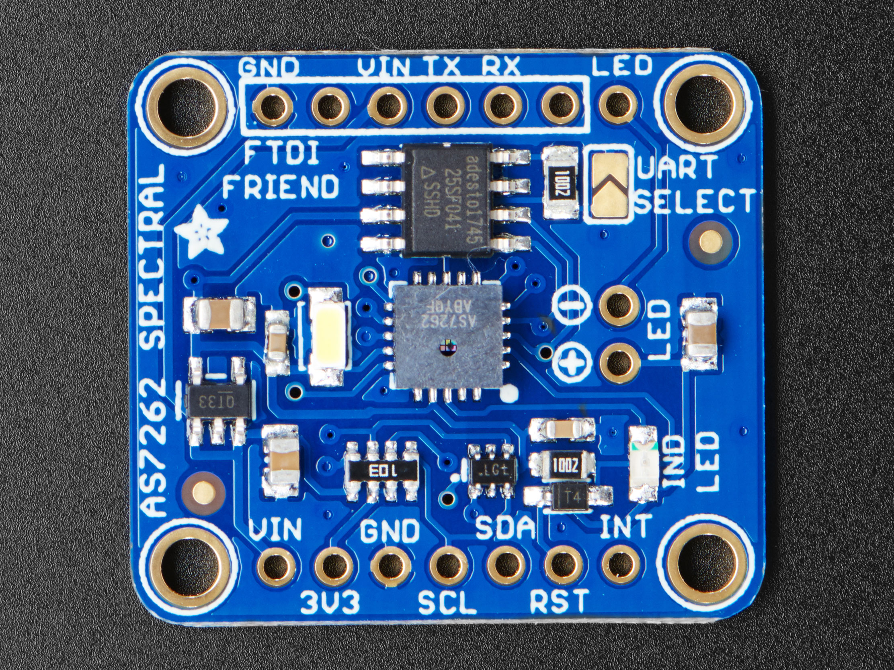

# Adafruit AS7262 6-Channel Visible Light/Colour Sensor Breakout

## Beschreibung
Hier ist eine deutsche Übersetzung der Produktbeschreibung des **Adafruit AS7262 6-Kanal-Sensors für sichtbares Licht/Farberkennung**:

***

Der Adafruit AS7262 6-Kanal-Sensor für sichtbares Licht/Farberkennung von AMS verfügt über sechs integrierte Kanäle zur Erfassung von sichtbarem Licht:
Rot (650 nm)
Orange (600 nm)
Gelb (570 nm)
Grün (550 nm)
Blau (500 nm)
Violett (450 nm)
Die sechs Spektralkanäle werden durch Silizium-Interferenzfilter realisiert. Die FWHM (Full Width at Half Maximum) beträgt 40 nm.
Diese Kanäle können über denI²C-Bus entweder als:
- Rohwerte (16 Bit) oder als
- kalibrierte Gleitkommawerte
ausgelesen werden.  
Zusätzlich ist ein integrierter Temperatursensor vorhanden, mit dem die Chiptemperatur gemessen werden kann.
Ein leistungsstarker LED-Blitz sorgt für eine gleichmäßige Beleuchtung der Objekte und damit für eine bessere Farberkennung.  
Das Breakout-Board nutzt standardmäßig die I²C-Schnittstelle des Chips, bietet jedoch auch eine UART-Schnittstelle, die AT-Befehle akzeptiert.  
Adafruit hat den Sensor bereits auf einer komplett bestückten Leiterplatte untergebracht, inklusive:
- vorprogrammiertem SPI-Flash-Chip (mit der Geräte-Firmware),
- 3,3 V-Spannungsregler,
- I²C-Pegelwandler und  
- der empfohlenen LED-Beleuchtung.  
Sowohl I²C- als auch UART-Anschlüsse sind herausgeführt, wodurch dieses Breakout eine praktische All-in-One-Lösung für Farberkennungsanwendungen ist.  
Die UART-Pinbelegung ist Plug-and-Play-kompatibel mit dem Adafruit FTDI Friend.

## Technische Daten
Breiter analoger Eingangsspannungsbereich von -5 V bis +5 V
Entspricht dem JEDEC-Standard Nr. 7A
Niedriger Einschaltwiderstand:
80 Ohm (typisch) bei VCC - VEE = 4.5 V
70 Ohm (typisch) bei VCC - VEE = 6.0 V
60 Ohm (typisch) bei VCC - VEE = 9.0 V
Logikpegelumsetzung: Ermöglicht die Kommunikation von 5 V-Logik mit analogen ± 5 V-Signalen
Typische integrierte "Pause vor dem Make"
ESD-Schutz:
HBM JESD22-A114F übersteigt 2000 V
MM JESD22-A115-A überschreitet 200 V
CDM JESD22-C101E überschreitet 1000 V
Angegeben von -40 ℃ bis + 85 und -40 bis + 125

## Bezugsquelle
[Amazon Produktseite](https://www.amazon.de/dp/B07DM1V932))

## Foto

## Funktionsdiagramm

## Datenblatt
[Adafruit AS7262 6-channel Visible Light Sensor](https://learn.adafruit.com/adafruit-as7262-6-channel-visible-light-sensor/overview)

[AMS AS7262[(https://cdn-learn.adafruit.com/assets/assets/000/052/623/original/AS7262_DS000486_2-00_%281%29.pdf?1522179774)

## Anwendungsbeispiel
[Anwendungsbeispiel1](https://jschrier.github.io/blog/2023/02/01/Reading-AS726x-and-AS7265X-Spectral-Sensors-in-Micropython.html)

[Anwendungsbeispiel2](https://github.com/jajberni/AS726X_LoPy)

## Fritzing Part
[Fritzing Part](https://github.com/sparkfun/Fritzing_Parts/raw/refs/heads/main/products/13906_sfe_74hc4051_mux_breakout.fzpz)
